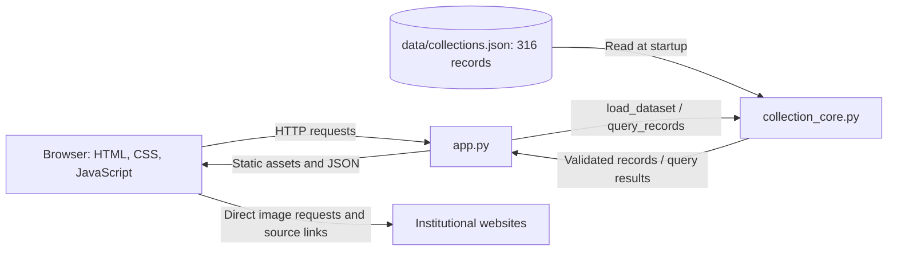

# Architecture and data flow

The Python standard-library HTTP server loads and validates the JSON snapshot
once at startup. Records remain in memory; data changes require a restart.
Search and statistics use the local snapshot and do not call external APIs.
The browser fetches institutional images directly.

The public deployment is hosted on Render at
https://collection-explorer-93n8.onrender.com. Render provides the public HTTPS
endpoint for this same Python application and its static files. The server
supports binding to `0.0.0.0` and using Render's `PORT` environment variable;
no additional application framework or database is required.

The core validates parameters, filters records, scores keyword matches,
sorts, calculates statistics and then paginates. Statistics cover every
matched record; filter choices describe the full dataset.
Search requires every token to match one of seven fields. Field weights are
title 8, category 4, materials 3, places 2, collection 1, date 1 and source name 1.
Repeated query tokens count once. Ties use record IDs for deterministic ordering.
Date filters include overlapping intervals; unknown years sort last in both date orders.

The server supplies `/api/meta`, `/api/collections` and `/api/objects/{id}`.
It limits static files through an allowlist and rejects traversal and symlinks.
The interface and server belong to the web contributor; this document describes
those existing components without changing them. AI verified basic public
static-file and API availability on 2026-10-10. Complete browser workflows,
mobile layout and external image loading remain to be checked.
