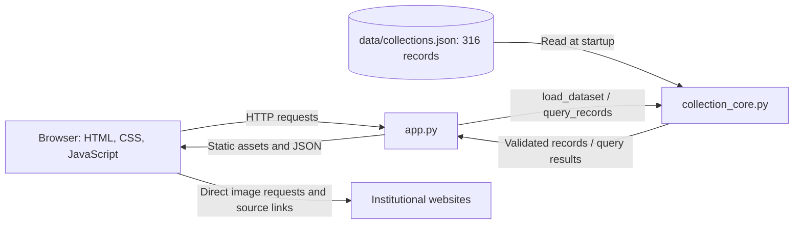

# Architecture and data flow

The Python standard-library HTTP server loads and validates the JSON snapshot
once at startup. Records remain in memory; data changes require a restart.
Search and statistics use the local snapshot and do not call external APIs.
The browser fetches institutional images directly.

The core validates parameters, filters records, scores keyword matches,
sorts, calculates statistics and then paginates. Statistics cover every
matched record; filter choices describe the full dataset.
Search requires every token to match one of seven fields. Field weights are
title 8, category 4, materials 3, places 2, collection 1, date 1 and source name 1.
Repeated query tokens count once. Ties use record IDs for deterministic ordering.
Date filters include overlapping intervals; unknown years sort last in both date orders.

The server supplies `/api/meta`, `/api/collections` and `/api/objects/{id}`.
It limits static files through an allowlist and rejects traversal and symlinks.
The interface and server belong to the web contributor; this document describes
those existing components without changing them. Browser checks and deployment
remain outstanding.
